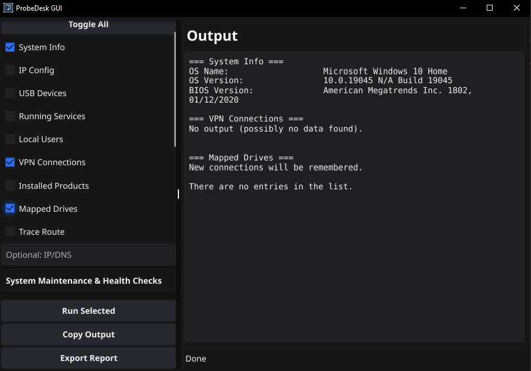

# ProbeDesk

**ProbeDesk — Lightweight Windows System Administration & Information-Gathering Tool**

© 2025 RainyRoot — MIT License

---

## Overview

ProbeDesk is a small, modular tool written in Go, designed to quickly enumerate Windows system information, perform common network and maintenance tasks, and export collected data into a combined report.  
It is built for system administrators, pentesters, and power users who want a unified interface for useful PowerShell and Windows commands.

System-modifying actions (such as DNS flush, DISM repairs, or Windows Update resets) require administrator privileges.

---

## Features / Modules

ProbeDesk is modular. Select the tasks you want to run, toggle all, or export all results in one report.

To execute commands, enable the desired checkboxes and click **Run Selected**.  
Use **Report Format** to export results, or **Copy Output** to place them in your clipboard.

### Enumeration Modules

* **System Info** — General system information (OS, CPU, RAM, BIOS, uptime)
* **IP Config** — Network interfaces, addresses, DNS, gateways
* **USB Devices** — Connected USB devices and controllers
* **Running Services** — All currently running Windows services
* **Local Users** — Local user accounts and relevant attributes
* **VPN Connections** — Detects configured and active VPN profiles
* **Installed Products** — Installed software (Win32 + Registry)
* **Mapped Drives** — All mapped network drives
* **Trace Route `<host>`** — Network route to a given host/IP

### Systeme Maintenace & Health Checks (require administrator privileges)

* **Check Health** — Quick DISM/SFC-based system health check
* **Scan System Health** — Full scan using SFC and DISM
* **Restore Broken Windows Image** — Attempts to restore system image
* **Check for Windows Updates** — Queries available updates
* **Reset Windows Update** — Resets Windows Update services and cache
* **Flush DNS** — Clears DNS resolver cache
* **Search Uninstall String & MSI <String>** — Finds uninstall commands for software

### Other Features

* **Remote Target `<IP>`** — Execute supported commands on remote Windows hosts via PowerShell Remoting
* **Report Format** — Export data as HTML or Markdown
* **Run Selected** — Executes all enabled modules

---

## Installation

1. Download `probedesk_windows_amd64.zip` from the [latest release](https://github.com/RainyRoot/ProbeDesk/releases/latest).
2. Extract and run `probedesk.exe`.
3. For remote execution, ensure PowerShell Remoting (WinRM) is enabled.

---

## Supported Report Formats

* **HTML (.html)**  
* **Markdown (.md)**  

Formats are auto-detected based on file extension or via the `Report Format DropDown-Menu` argument.

---

## Best Practices & Notes

* Commands that modify system state require administrator privileges.  
* Remote Target requires PS Remoting and valid credentials.  
* Generated reports may contain sensitive information; store them securely.  
* Combine modules for custom reports, for example:

---

## Related Projects

| Project        | Description |
|----------------|-------------|
| ProbeDesk-CLI  | CLI-only version with autocomplete and safety checks |
| ProbeDesk-GUI  | Windows GUI version (this repo) |

---

## Troubleshooting

* **Remote Target fails**  
  Ensure WinRM is enabled and allowed through the firewall.

* **Permission denied**  
  Run PowerShell as Administrator.

* **Winget not found**  
  Install Winget or ensure it is included in the PATH.

---

## Contributing

Contributions and feature requests are welcome.  
Preferred workflow:

1. Open or comment on an issue.  
2. Create a branch using: `feature/<name>` or `fix/<name>`  
3. Submit a pull request with a clear description and relevant tests or examples.

---

## License

ProbeDesk is licensed under the MIT License.  
See LICENSE for details.

---

## Contact

RainyRoot  
Discord: rainy123

---

## Changelog

**v1.0**

- Initial release including core enumeration modules, admin utilities, and HTML/Markdown report generation.
- Fixed German special character (Umlaute/Sonderzeichen) rendering in HTML reports.

